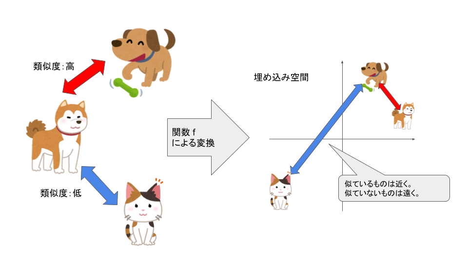
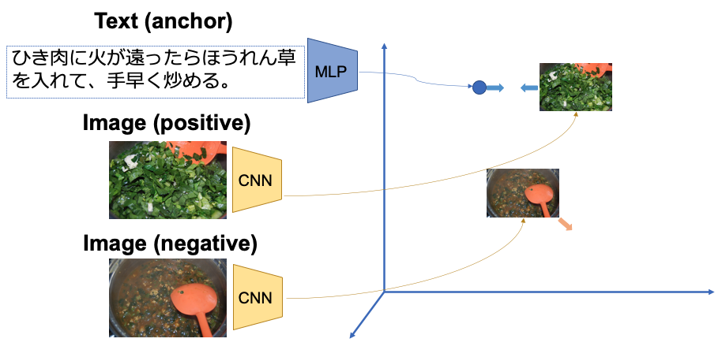

# MetricLearningとは
まず、MetricLearning is 何？というお話です。MetricLearningは日本語では距離学習と呼ばれていて、複数のデータ同士の関係性を考慮して特徴量空間と呼ばれる空間上にマッピングする非線形的な変換を学習する方法です。

以下の図のように犬と猫を特徴量空間や埋め込み空間と呼ばれる空間上にマッピングすると、似ているもの同士（犬）は距離が近くなり、猫だけが離れた位置にあることがわかります。データを空間上にマッピングし、データ間の距離から様々なタスクに応用することが可能です。



【画像出典：[https://ai-scholar.tech/articles/metric-learning/Metric-ai-402](https://ai-scholar.tech/articles/metric-learning/Metric-ai-402)】

MetricLearningを用いた技術には今回実装する画像検索システムの他にも、顔認証をはじめとした生体認証や、異常検知などがあります。MetricLearningは特徴量空間（埋め込み空間）にデータをマッピングして、距離を用いた類似度計測を行うので、学習に用いていない任意のデータへの適用も可能にします。

DeepMetricLearningのわかりやすい説明をされているQiitaの記事があったのでリンクを載せておきます。
（→[Deep Metric Learning 入門](https://qiita.com/gesogeso/items/547079f967d9bbf9aca8#1-deep-metric-learning-%E6%A6%82%E8%A6%81)）

また、MetricLearningを使ってTwiceのメンバーの顔写真を空間上にプロットして、メンバーを見分けるタスクに取り組んでいたQiita記事も面白かったので載せておきます。Twice可愛かった。
（→[Metric LearningでTWICEのメンバー9人を見分けるPyTorch入門](https://qiita.com/TodayInsane/items/26e99bd1a7ac69d4277b)）

# レシピのテキストから画像検索
今回はMetricLearningを使って、画像の検索システムを作ってみみました。イメージとしてはテキストと画像を全て同じ空間上にマッピングし、一つのテキストとそれに対応する画像との距離が近くなるように学習させます。
今回使うデータは研究室にあるレシピのデータなのでデータ自体は公開できないのですが、コードはgithubに載せておきます。

画像検索システムを構築していく手順は以下のようになります。
1. テキストと画像をベクトル化し、それぞれの次元を統一。
2. 一つのテキストと全ての画像との距離を計算。
3. 計算した距離を用いてソート。
3. テキストクエリに対し、距離が近く類似度の最も高い画像を出力。



テキストのベクトル化については、扱うレシピが日本語なので形態素解析し、出現頻度の高い助詞や助動詞をストップワードとして除去した上で、全ての形態素をWord2Vecで300次元に変換し、レシピの1工程ごとに算出した平均をその1工程のベクトルとしました。

画像のベクトル化については、学習済みのResNetモデルを用いて特徴量を抽出しました。

# テキストのベクトル化
word2vecは用途に合わせた学習済みモデルが多く公開されていたりしますが、今回扱うデータはドメインがレシピなので、食材の名前や調理の関する語彙が多かったので、レシピのテキストからword2vecを学習させました。コーパスをMeCabで形態素解析して、これをgensimを使って300次元にベクトル化します。
（→[github code](https://github.com/kent0304/Text2ImageRetrieval/blob/master/word2vec.py)）

```python [word2vec.py]
from gensim.models import Word2Vec

# word2vecモデル学習（gensim version 3.80）
model_300 = Word2Vec(sentences=token_data,
                 size=300,
                 window=5,
                 min_count=1,
                 workers=8)
```

このword2vecモデルを使って、形態素解析されたレシピのテキストにおける全ての形態素をベクトルに変換し、その平均をそのレシピのベクトルとします。このとき、レシピのテキストにおいて頻出度が高い助詞や助動詞、句読点や記号などは、そのレシピにおける重要な意味を持たないという仮説のもと、ストップワードとして定義し、ベクトルの平均を取る際にストップワードの値は除去しました。
（→[github code](https://github.com/kent0304/Text2ImageRetrieval/blob/master/make_textdata.py)）

# 画像のベクトル化
画像については、学習済みのResNetモデルの特徴量を抽出して利用します。PyTorchから学習済みモデルを以下のように呼び出すことができるんですが、ResNetの最終層は分類タスクの為のsoftmaxになっているので、最終層はカットして画像の特徴量を表している（であろう）2048次元の最終層の手前の層までを使います。Identity()という関数は入力をそのまま出力として返す恒等関数の役割を持つので便利でした。また、eval()で訓練モードにすることも注意です。私はこれを忘れて沼にはまり時間をかなり溶かしました...（汗）
（→[github code](https://github.com/kent0304/Text2ImageRetrieval/blob/master/make_imagedata.py)）

```python
import torch
from torch import nn
from torchvision import transforms, models

image_net = models.resnet50(pretrained=True)
image_net.fc = nn.Identity()
image_net.eval()
```

# データセットの作成

# モデルの作成

# 学習

# 評価

# まとめ


