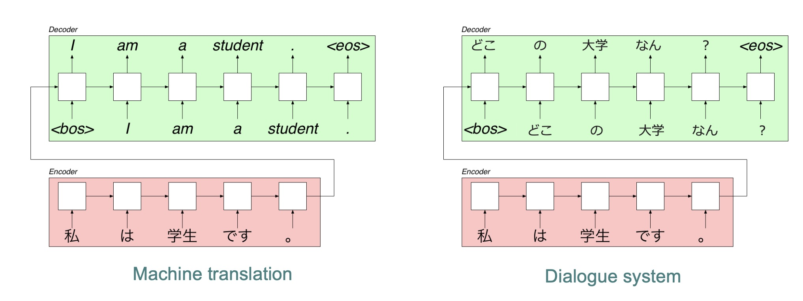
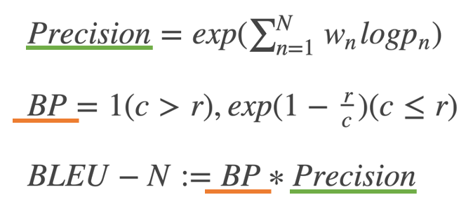
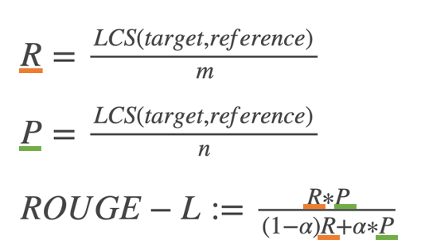

こんにちは．
今大学院で，通称「分野別演習」と呼ばれる，他の研究室に行って研究を実施する演習型の授業を履修しており，自然言語処理の研究室で雑談のできる対話システムの開発に取り組んでいます．

今回実装する対話システムの仕組みを簡単に説明すると，上図のようになっていて，機械翻訳に使われているSeq2Seqのモデルをそのまま利用します．
機械翻訳は入力と出力が以下のように，

- 入力：調子はどう？
- 出力：How are you doing?

入力と出力が与えられ，あらゆる翻訳される言語の入力に対し，翻訳済みの言語を出力として学習することで，尤もらしい出力を推測できるようになります．
対話システムは機械翻訳上の出力を対話の応答に変換して考えれば良いだけなのでイメージしやすいかと思います．
つまり，

- 入力：調子はどう？
- 出力：まぁぼちぼちやな．

対話システムでも入力に対し，返答されるであろうセリフを出力として学習することで，入力に対する出力が予測できるようになるということです．

## どう評価するべきか
### 概要
今回は["Survey on Evaluation Methods for Dialogue Systems"](https://arxiv.org/pdf/1905.04071.pdf)を参考にどういった評価手法が適切か考えてみます．
対話システムの評価は非常に難しい課題の一つで，人が判断するのと同じくらいの精度で，自動化され，何度も何度も実施できるようなものが好ましいです．以下に示す項目が必要となります．
- 自動化：労働力の削減
- 繰り返せるかどうか：評価手法は何回やっても同じ結果が表示される
- 人的評価に似てるか：人間の判断に相関している
- 異なる対話システム間での差別化：評価手順は，異なる戦略間で差別化できるようにする
- 説明できるか：その対話システムのどのような特徴が，その評価手法の品質に大きく影響しているかを明らかに

### 人手手法
評価手法は自動化できることが理想であるが，ここでは人手による評価手法も紹介します．人手手法にも様々な方法があるのですが，被験者は対話システムに触れて，対話や発話に対して採点する，この2つのタスクを引き受けることが多いようです．
- 研究室での実験
- フィールドでの実験
- クラウドソーシング
現在ではクラウドソーシングにおいて実験を行うことが主流です．

### 自動化
上でまとめた要件を満たす手法は実はまだ開発されておらず，人間の判断にある程度相関を持たせるために人間が関与する必要があるか，相当な技術力が必要となります．ここでは，収集した人間の判断に依存するが人間の判断をモデル化したもの，ユーザーの行動をモデル化したもの，より細かいモデルに分類することができます．

## 現存の評価手法
["Survey on Evaluation Methods for Dialogue Systems"](https://arxiv.org/pdf/1905.04071.pdf)によると，一般的なアプローチ方法は2種類あり，「応答の適切さ」と「人間らしさ」だ．しかし，これらのアプローチはどちらも非常に大雑把で，全体像が明らかにできていません．それに加えて，その対話システムの特性に応じて特定の特性の精度を計測するとどうなるでしょうか．例えば，応答のパターンをバラエティ豊かにするために構築された対話システムは，語彙的な複雑さの尺度に基づいて判断されるべきです．
　紹介する評価手法は2つの段階に分けられており，1つ目が全体的な評価で充分な応答が得られているかということ，2つ目が詳細部分にフォーカスする対話システムの特定の特性に着目することです．1つめの充分な応答が得られているかという評価では，「応答の適切さ」と「人間らしさ」を特に評価します．2つ目に関しては，会話の一貫性を保つために工夫された方法や会話の話題を維持する方法に着目します．

### 応答の適切さ
応答の適切さを測るためには2つの方法があり，一つは word-overlap metrics で，もう一つが予測モデルをベースにしたものである．

(1) Word-overlap 手法

この手法は機械翻訳やようやくタスクでも使われており，簡単に適用できることから初期の対話システムでも使われていた．応答の適切さを測るのにBLUEスコア[Papineni+, 2002]やROUGE[Lin, 2004] はよく使われていたが，どちらも人の判断と相関性がないことが示されている[Liu+, 2016]．これを受けて人の判断をBLUEスコアに取り込んだ∆BLEUという手法も研究されている[Galley+, 2015]．これは，人間がテストセットの応答に対し文脈の関連性に応じて評価し，その評価がBLUEスコアに重み付けされることで，高評価な応答を有利にするようにしたものである．人の判断とのスピアマン相関係数を取るとBLUEスコアの場合よりも向上しているが，人手を必要とすることが課題である．
  - BLEU

  最も伝統的な指標は BLEU(Bilingual Evaluation Understudy) で,名前が示すとおり本来は機械翻訳で使用され始めた評価指標でした．Liuらが求めたセンテンスベースの BLEU 指標は下記のように示されます．

  

  Pnは生成文に含まれるn-gramの数で，リファレンス文にも含まれるn-gramをn-gramにつき1つと数え上げた数で割った値を指し，wnは重みパラメーターで，一様になるようにwn= 1/Nと置かれる事が一般的であるようです．BPは短すぎる文にペナルティーを課す項で，cは生成文の合計の長さ，rは基準の長さ，一般的にはリファレンス文の平均長が使用されます．

  - ROUGE

  ROUGE(Recall Oriented Understudy for GistingEvaluation)は，BLEUとは異なり，n-gramベースのPrecisionだけでなくRecallにも注目する手法で，文書要約の分野で登場してきた指標です．ROUGE-Nは、生成文中に現れるn-gramがリファレンス文中に出現する回数をもとに，RecallとPrecisionを計算する指標であり，RecallとPrecisionを合わせて評価するため，F1まで計算しそこで比較することが一般的です．

  

  LCSは，与えられた二つの文で最も長い一致部分の長さを返す関数で，mがリファレンス文の長さ，nが生成文の長さ，αは，調整用パラメータで一般的には0.5が使用されます．

  - Embedding Base

  LiuらはBLEUやROUGEのようなマッチング率を測るものだけではなく，単語の埋め込み(Embedding Base)を用いた3つの指標を公開しています．Greedy Matchingはリファレンス文と生成文に含まれる単語ベクトルと比較した際に，最もコサイン類似度が高くなる単語のコサイン類似度の平均をスコアとしたものです．また，Embedding Averageは生成文に含まれる単語のベクトルの平均と，リファレンス文に含まれる単語のベクトルの平均とのコサイン類似度をスコアとしたものを指します．さらに，Vector Extremaは，文に含まれる各単語の単語ベクトルのうち，各次元ごとに最大値もしくは最小値を，文のベクトルの対応する次元の値として，リファレンス文と生成文のコサイン類似度をスコアとしたものです．

  - Distinct

  近年のEnd2Endによる生成ベースの対話システムの開発の課題の一つに，システムが出力として，「わからない」や「いいよ」のように，どのような文脈にも適応できる短い応答を生成するということが挙げられています．Liはこの問題を解決するための手法を提案していますが，Distinctという評価手法も同時に示しています．定義は非常に明快で，Distinct-Nは，生成された複数文中で登場したn-gramの種類数を，複数文中に登場する全てのn-gramの数で割った値として定義されています．

(2) 予測モデルを用いた手法

人による適切であるかどうかの採点を予測するモデルをRNNで学習したADEMがある[Lowe+, 2017a]．審査員は対話の文脈と応答候補を提示され，1から5までの尺度で適切性を評価する． この評価に基づいて，文脈と応答を与えられたモデル応答をスコア化するために，RNNが訓練された．

### 人間らしさ
古くからある評価手法の一つに Turing test というものがあり，システムが人間を騙すことができるか測るものです．これに触発され，対話システムを評価する敵対性学習[Goodfellow+, 2014]が利用できます．生成的敵対モデルはデータを生成する生成器と，データが本物かシステム化を識別する識別器の2つから構成されています．これらは敵対的な方法で学習され，生成器は識別器を欺こうとし，識別器はデータが本物かシステムかを識別するために同時に学習されます．

### 対話システムの特性に応じた評価
対話システムが異なるトピックについてまとまりのある方法で話す能力を測定する．多種多様なトピックを話せるか（トピックの幅），1つのトピックについて長くまとまりのある会話ができるか（トピックの深さ）という評価が提案されています[Guo+, 2018]．ディープ平均化ネットワーク(DAN)を用いて，会話の発話をトピックごとに分類します．

## まとめ
今回は対話システムの評価手法について調べてみました．人間の評価に限りなく近い自動評価の研究は現在も進められており，どれも著しい成果が得られていないことがわかっています．評価手法が確立すれば，好ましい対話システムの実現に直結するだろうと考えられるので，解決すべき大きな課題の一つであるといえます．

次回は実際に対話システムを実装してみたいと思います！では．

## 参考文献
- [End2Endな対話システムの評価指標](https://ksksksks2.hatenadiary.jp/entry/20191202/1575212640)
- How NOT To Evaluate Your DialogueSystem:  An Empirical Study of UnsupervisedEvaluation Metrics for Dialogue Response Gener-ation
- A Diversity-Promoting Ob-jective Function for Neural Conversation Models