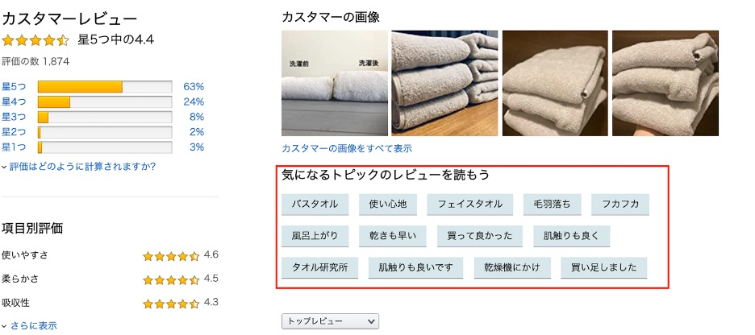
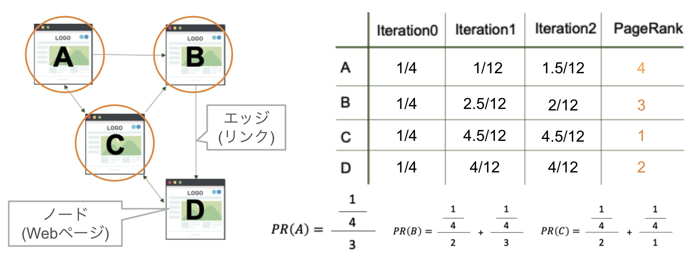
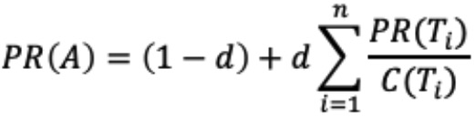
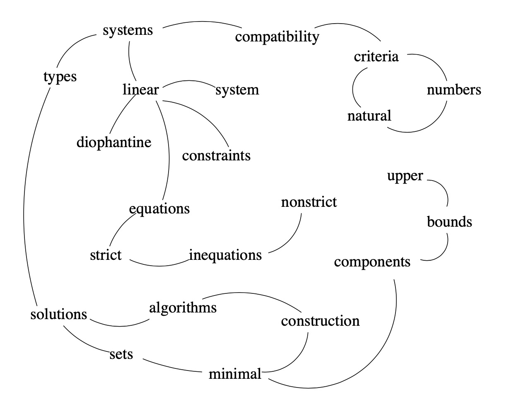
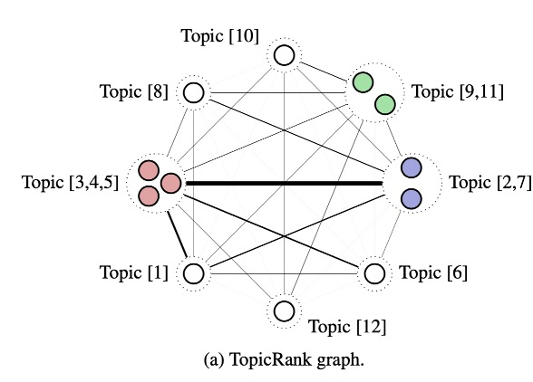
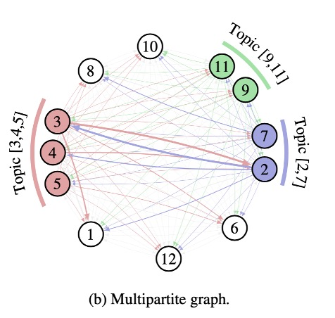
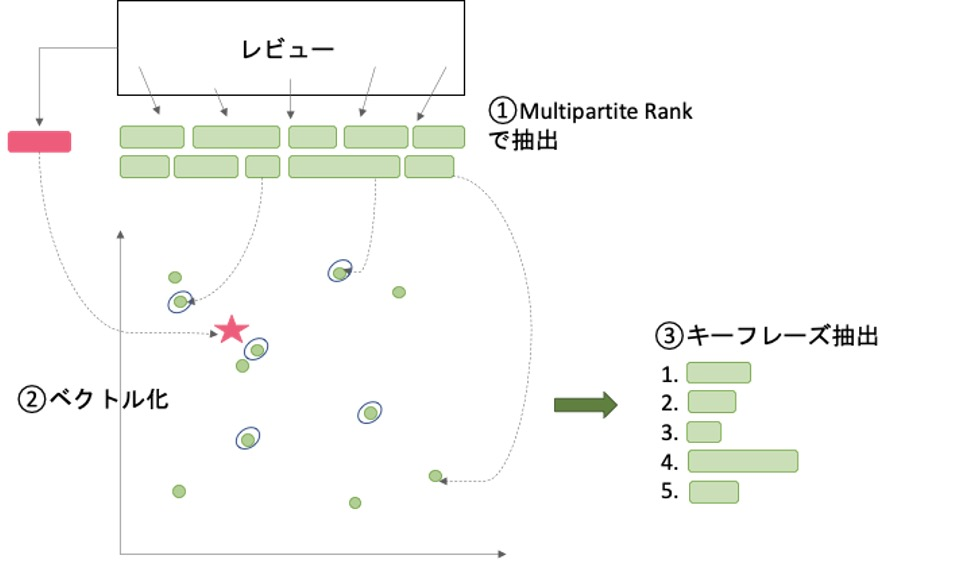
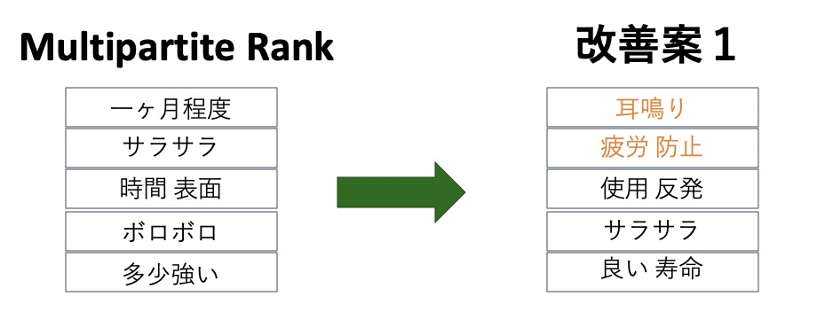

## 取り組んだタスク
レビューの本文から、商品の使用用途や特徴を示すキーワードもしくはキーフレーズを取得するというタスクに取り組んでみました。

こちらは某AのECサイトですが、ユーザーが気になるレビューをキーフレーズから探せる機能をモノタロウでも実現しようということです。これにより、ユーザーは商品の特徴を瞬時に判断できる上、SEO対策にも有用であるようです。

## 既存手法
### Page Rank
Page Rankはインターネット上でページからページへと張られたリンクをもとに、各ページの重要度を推定する手法です。多くのWebページからリンクが貼られていれば、そのWebページの重要度は高まります。これは **「引用回数が多い論文はいい論文」**であることを考えれば直感的に理解できるのではないでしょうか。

webページとwebページの繋がりは上図のようにグラフに表すことができ、ノードはwebページ、エッジはwebページ間のリンクとみなすことができます。

重要度を算出方法は、あるノードXが別のノードYとリンクする(エッジが存在する)とき、XからYに対して**投票**が行われたとみなすと、イメージしやすいかと思います。また、投票を行うノードの重要度も考慮されます。

### Text Rank

Page RankのWebページ（ノード）を**単語・句**、リンク（エッジ）を**単語・句間の関連度**に置き換えた手法です。

この手法を使って今回はキーフレーズ抽出を行うのですが、手順はざっと以下のような流れとなります。

① 形態素解析

② 構文フィルタを通った全ての語彙単位がグラフに追加

③ 最大単語数Nの単語window内で共起する語彙単位の間にエッジを追加

④ 各頂点の初期スコアは1とされ閾値0.0001に収束するまでイテレーション

⑤ 各頂点の最終スコアが決まると降順ソートされ上位T個を保持

⑥ 隣接するキーワードがあれば1つにする

### Topic Rank

Topic Rankは「延長コード」、「コード」のように表現が重複するキーフレーズ複数抽出される問題を解決するために、類似した単語・句をトピック単位にまとめてノードとする手法です。

具体的にはグラフを構成する前にクラスタリングを行ってトピック単位にまとめるステップが入ります。

### Multipartite Rank

Topic Rankでは重要なトピックが選出されてから、トピック内の複数のキーフレーズ候補から一つを抽出するのに経験則が必要でした。これを解決するために、トピック内に並ぶキーフレーズ候補のうち最初に登場するものを優遇するような重み付けを行います。
### 抽出結果
某ECサイトの商品コード毎にランダムに10投稿抽出したレビュー文書（10投稿合わせる）に対して、まずはMultipartite Rankでキーフレーズ抽出をしてみました。

ここではキーフレーズ抽出結果の一例を紹介したいと思います。「耳栓（イヤープラグ）」という商品のキーフレーズを抽出した結果、

**「一ヶ月程度」、「サラサラ」、「時間 表面」**

といったようなキーフレーズが抽出できました。
うーん、微妙ですね。
もっと、ユーザーがレビューで伝えようとしていたであろうフレーズが他にあっただろうと思ってしまいます。

## 提案手法
### 手法概要
既存手法のMultipartite Rankを試した結果、上記の通り商品の特徴を掴んだキーフレーズ抽出ができていないという課題が見つかりました。

そこで、EmbedRank[Kamil+ 2018] を参考に、レビュー全体とキーフレーズの意味的類似度を用いることで、ユーザがレビューにおいて伝えたいことを考慮できないだろうかと考えました。

流れとしては上図のようなイメージです。

1. はじめに、既存手法通り、MultipartiteRankでキーフレーズを抽出します
2. レビュー全体と各キーフレーズをベクトル化します。(ベクトル化にはUniversal Sentence Encoderを使用)
3. 意味的類似度を考慮してキーフレーズを再抽出します。

レビューのベクトルに近いキーフレーズであれば、ユーザーがレビューで伝えたいものに近づくだろうと考えたのでこの手法を試してみました。
### 抽出結果
既存手法のときと同様に、商品コード毎にランダムに10投稿抽出したレビュー文書（10投稿合わせる）に対して、提案手法でキーフレーズ抽出をすると以下のような結果になりました。

「耳鳴り」、「疲労 防止」といったような新しいフレーズが追加されています。

今回のタスクでは時間的制約があったため定量的な評価は実施していませんが、レビューを確認したくなるような気になるキーフレーズの抽出ができたのではないでしょうか。

ユーザがレビューにおいて伝えたい商品の特徴となるキーフレーズの抽出を確認できました。

## まとめ
レビュー文書からキーフレーズを抽出するタスクに取り組んでみました。今回のキーフレーズ抽出の実験では完全なる僕の主観での定性的な評価しか行うことができなかったので、今後は定量的な評価も導入する必要があります。また、可能であれば実際にECサイトを運用してユーザのクリック率や購買情報なども評価の一つとして考察することが好ましいかもしれません。それでは。

