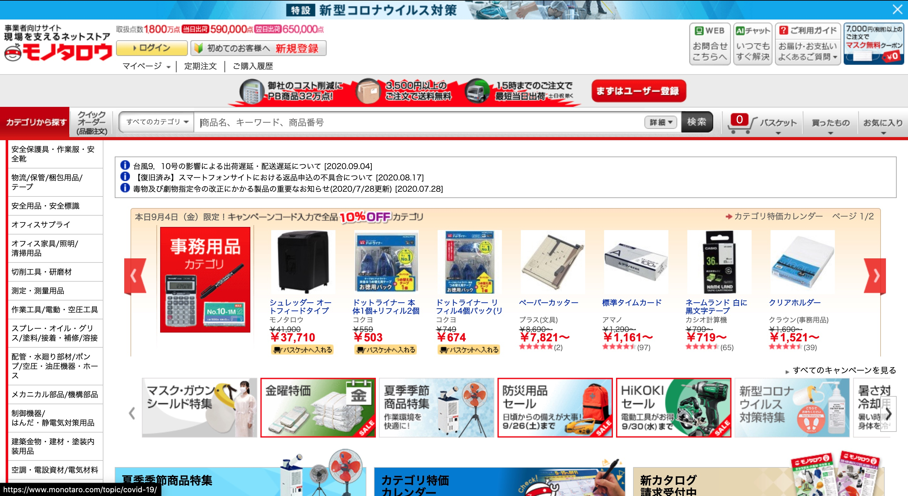

製造業、工事業、自動車整備業の現場で必要な工具、部品、消耗品、文具などを揃える日本の大手ECサービスを運営する某のサマーインターンシップに参加してきました。

今回はデータサイエンティストとして5日間働かせていただいたので、取り組んだことなどをまとめたいと思います。

ちなみにECサイトはこんな感じ。

## 参加するまで
### 志望動機
私は普段大学院で自然言語処理の研究をしており、言語処理のアカデミックな面だけでなく、実際にビジネスの第一線でどのように利用されているのかに関心を抱いていました。また、専門分野の技術を活かしたサマーインターンシップに参加したいなと思い、[魔法のスプレッドシート](https://docs.google.com/spreadsheets/d/1O4LqD6tfVisshD4YngjEKwpU1FQCGuD8vZ1qlVX0sBY/edit#gid=1644405096)から某社の募集要項を見つけて応募しました。

私は学部は機械系の学科だったこともあり、研究室で歯車などの部品を注文する際に某社のECサイトは利用していたので、少しだけ馴染みがありました。

### 選考
書類選考　→　コーディング試験（アルゴリズム）　→　一次面接（人事）　→　二次面接（技術）　→　合格

応募は200人近くあったようで、参加者は13人ほどでした。ほとんどが国立の院生だったと思います。

## 取り組んだタスク
レビューの本文から、商品の使用用途や特徴を示すキーワードもしくはキーフレーズを取得するというタスクに取り組みました。

こちらは某AのECサイトですが、ユーザーが気になるレビューをキーフレーズから探せる機能をモノタロウでも実現しようということです。これにより、ユーザーは商品の特徴を瞬時に判断できる上、SEO対策にも有用であるようです。

## 流れ
インターンシップの初日は人事の方から説明があり、午後以降は2人1組に分かれてメンターの社員さんの指導のもと、早速業務に取り組みました。

私のグループはキーフレーズを抽出するタスクだったので、初日はその手法の調査を行います。ACL(自然言語処理のトップカンファレンス)をメインに既存手法を精読しました。

初日は論文の調査で終わり、2日目には調査した既存手法を実際に実装してその精度（キーフレーズの抽出結果）を手元で確認しました。その結果をもとに独自の改善案を考えます。

3日目、4日目は考えた独自の改善案をもとに実装しその精度の確認と考察を行いました。

最終日には取り組んだタスクについて発表する機会があります。ここでは5日日取り組んだタスクの概要、既存手法の紹介とその問題点、独自の提案手法の紹介とその結果、インターンシップを通して感じたことなどをメインに2人1組で発表しました。この場ではデータサイエンスの部署とエンジニアの部署の他のインターン生の発表も聞く事ができるのがよかったです。

また、それと同時に、会社全体の会議や部署（データサイエンス）内の勉強会に参加させて頂いたり、3日目の夜の懇親会では社員さんとざっくばらんにお話できる機会もあったので、インターンシップを通してデータサイエンティストとして働く自分をイメージすることができました。

## まとめ
データサイエンティストとしてのインターンシップは今回が初めてでした。

初日に取り組むタスクが決まって、それに関する関連分野の論文を調査するところから業務は始まり、モノタロウのレビューデータを用いてキーフレーズ抽出を実装し、その内容を最終日に発表しました。

論文調査からキーフレーズ抽出機能実装という一つの成果物を生み出す段階まで5日間でやり遂げるのはなかなかハードでしたが、とても貴重な経験でした。また、インターンシップは現地開催ではなくオンライン開催ということで少し不安もあったのですが、メンターの社員の方はいつも優しくフォローしてくださるので、特に問題なく作業に取り組む事ができました。

5日間という短い期間でしたが社員の皆さんありがとうございました。