情報学研究科の学生としてPC組み立てくらいできた方が良いだろうということで、研究室に各パーツが揃っていたこともあり、組み立ててOSインストールまで行った記録をここに残しておこうと思います。

自作PCに挑戦するのは初めてなので、[こちらのサイト](https://www.ark-pc.co.jp/bto/customizer/?pc_id=1167)を参考に研究室でパーツを揃えていただきました。

## マザーボード
順番に各パーツを開封していくのですが、まずはケース兼マザーボードです。かなり小型ですよね。わからない方のために説明しておくと、このマザーボードと呼ばれる板にCPUやメモリなどPCに必要なパーツを順番に装着していくので基盤のようなものだと認識してもらえれば良いと思います。

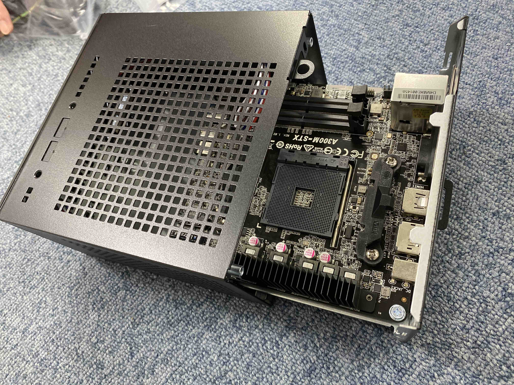

## SSD
はじめにSSDをマザーボードに取り付けていきます。こちらが今回取り付けるSSD。容量は64GB。（ﾁｯﾁｬｲﾈ）

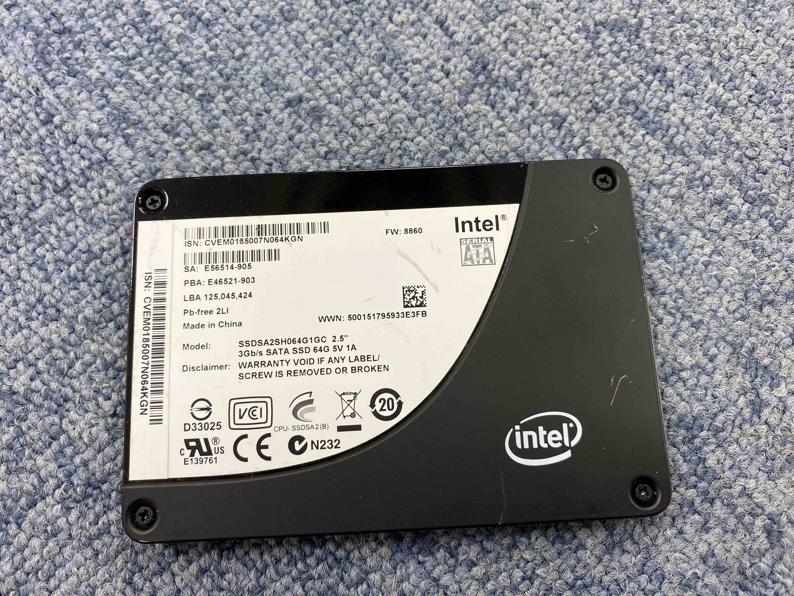

PCには必ずデータを保存するために内蔵ストレージと呼ばれる領域が存在しており、以前は「HDD」が主流でしたが、近年「SSD」が増加しており、その違いを紹介しておきます。

- HDDとは

データやプログラムを電磁的に読み書きする記憶装置で、SSDと異なり保存できるデータ量が多い一方で衝撃に弱いなどの特徴があります。

- SSDとは

半導体素子メモリを使ったドライブで、衝撃に強く、発熱、消費電力が少ない。読み書きの速度が速い。作動音がない。HDDよりサイズが爺さく軽い。
一方で、容量が少なく、容量単価としての価格は高いです。

> 参考文献 [そもそもSSD・HDDの違いってなに？ PCを選ぶ際にも気をつけたいストレージの種類](https://www.pro.logitec.co.jp/about_hdd/hddssd/0718/)

下の写真のようにマザーボードの裏側からネジでしっかりと固定して端子を接続させます。

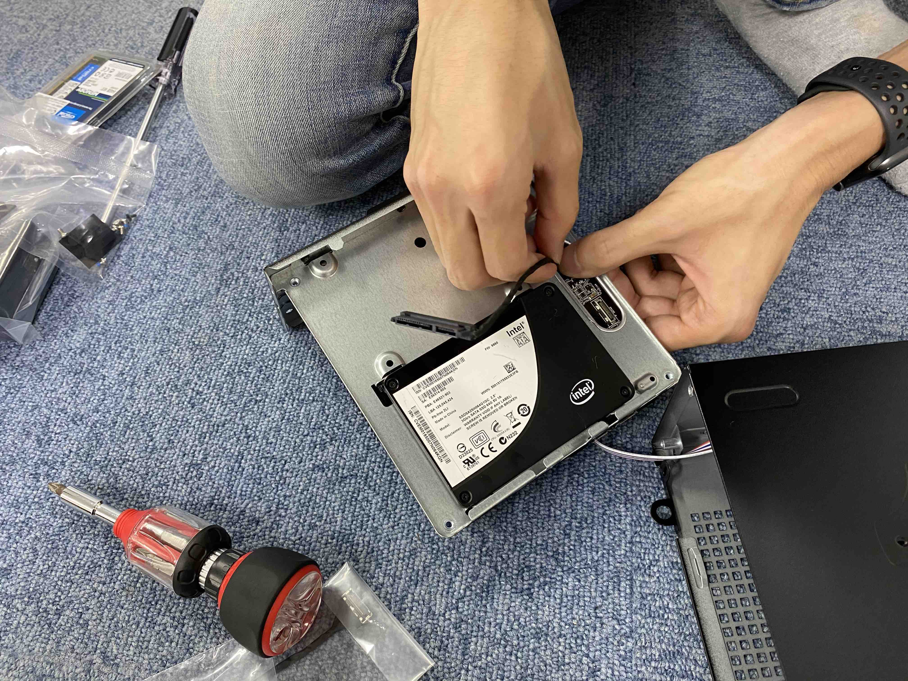

これでマザーボードへのSSD取り付けが完了しました。

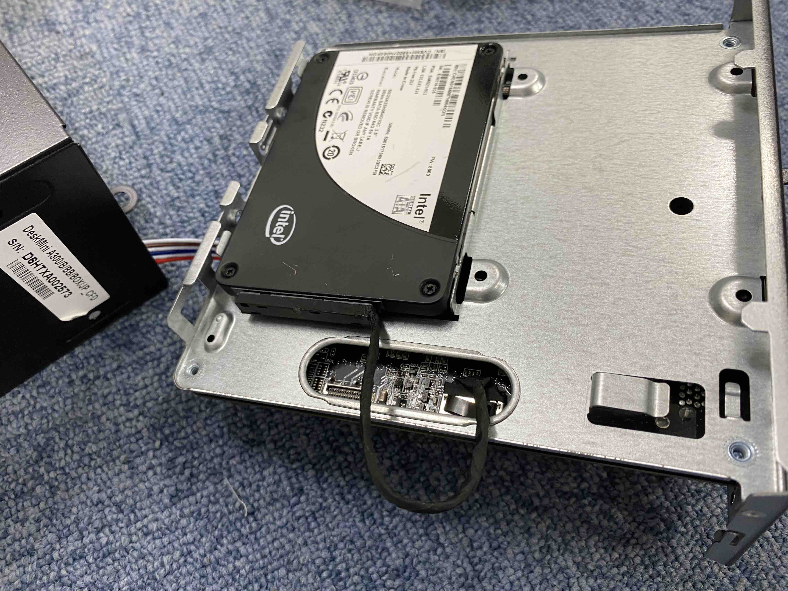

## メモリ

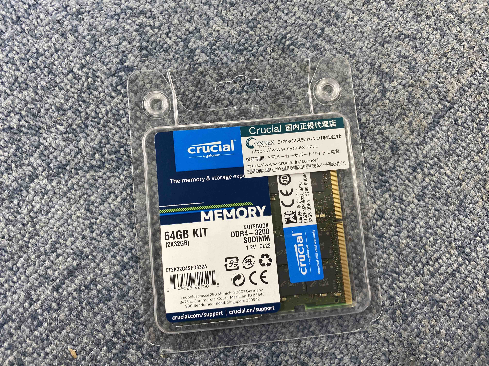

メモリはパソコンのOSやアプリケーションを動作させるために必要な情報を読み込み、一時的に保存するような役割を果たしており、電源を切れば読み込んだ内容は消去され、再度電源を入れると読み直されます。メモリはいわば**作業机**と呼ばれることも多く、メモリの性能が良いとは作業机が広いことを意味します。

メモリは以下の写真のように、向きを合わせて縦に差し込みます。差し込む際ある程度の力が必要で破損してしまわないか冷や冷やしました。セットしてまっすぐ力を入れて押すコツが必要みたいです。

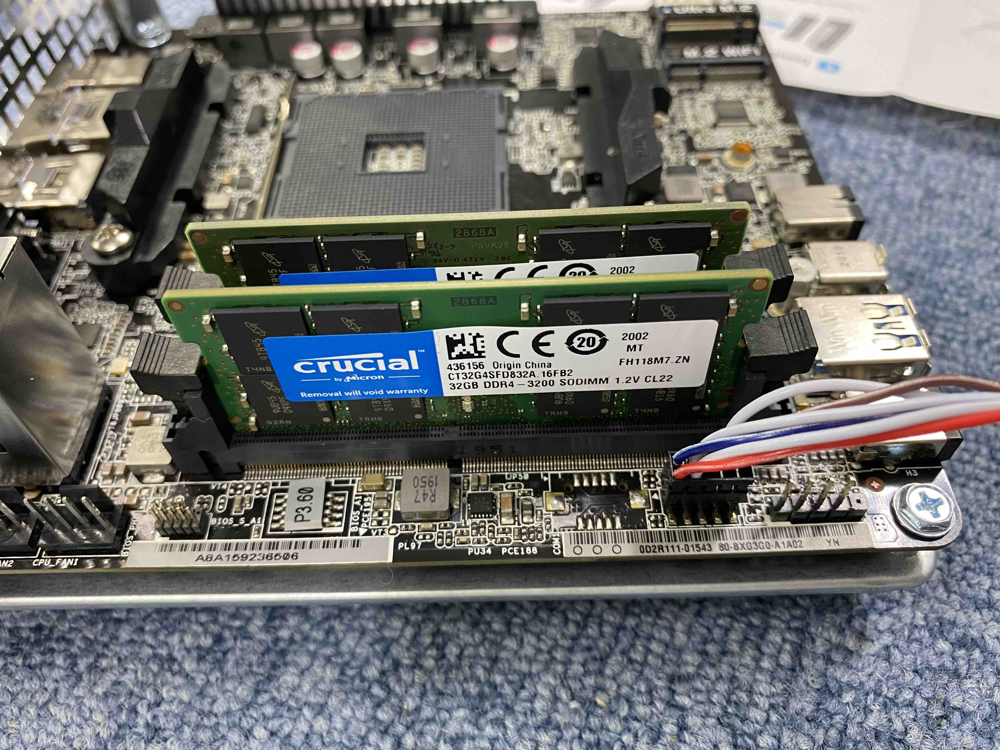

## CPU
さぁ次はCPUです。先ほどメモリを作業机と例えましたが、CPUは作業する人を表します。この人の頭が良ければPCのスペックも上がるというわけですね。

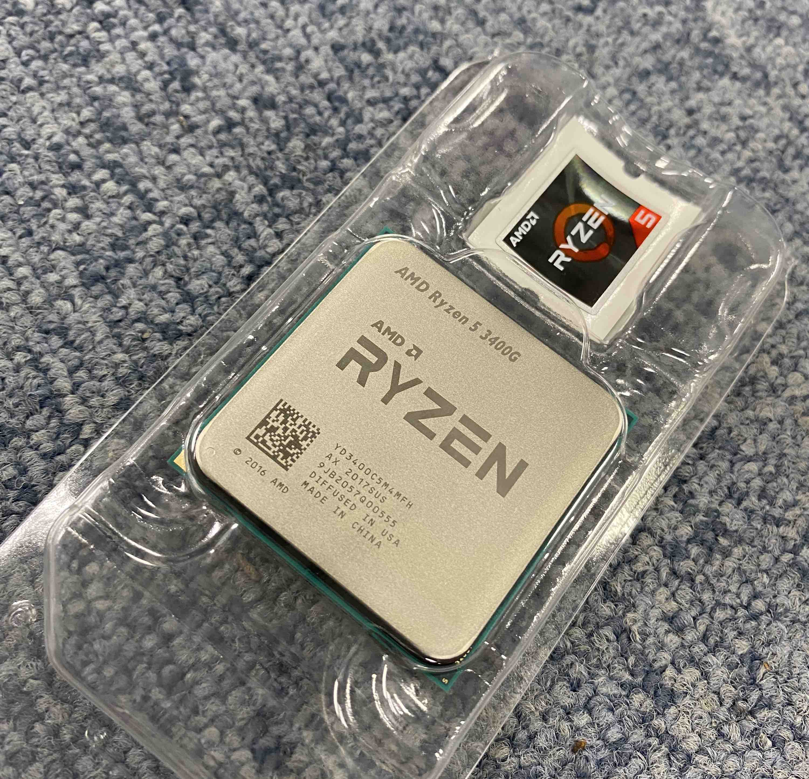

CPUの二代大手と言えば、**Intel**と**AMD**が挙げられるのかなと思います。今回研究室では初めてAMDのRYZENというものを購入してみました。

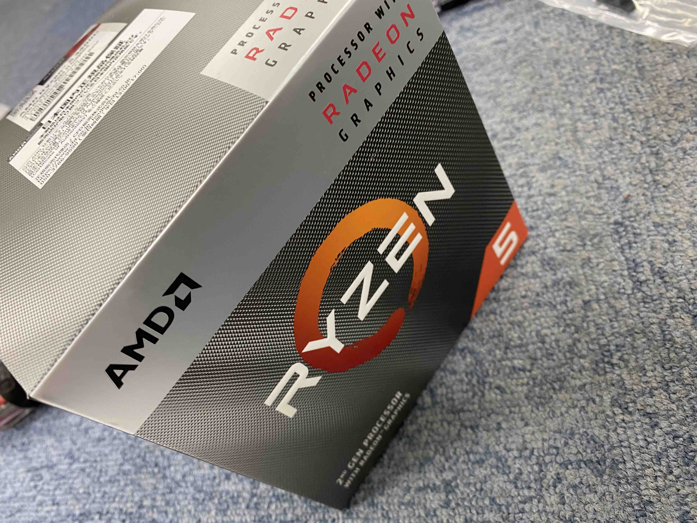

このCPU本体をマザーボードに慎重に取り付けていきます。

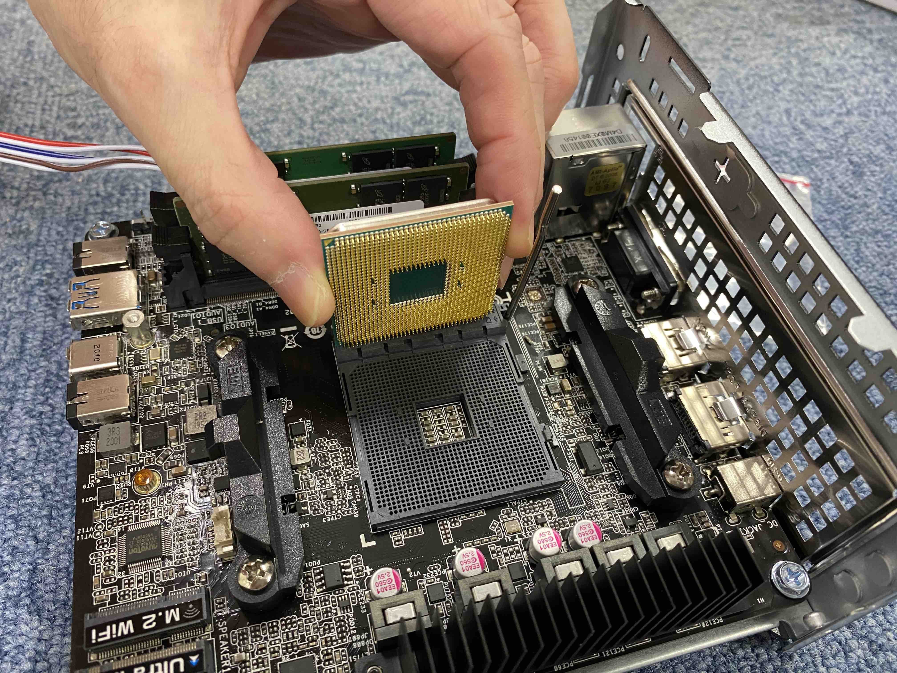

## CPUファン
続いて取り付けたいのがCPUファン。CPUが発する熱を少しでも下げるために必須です。

実はマザーボードを購入した時、さらにRYZENというCPUを購入した時にもCPUファンが付属でついていました。しかし、今回は別でCPUファンを購入していたので、そちらを使っていきます。

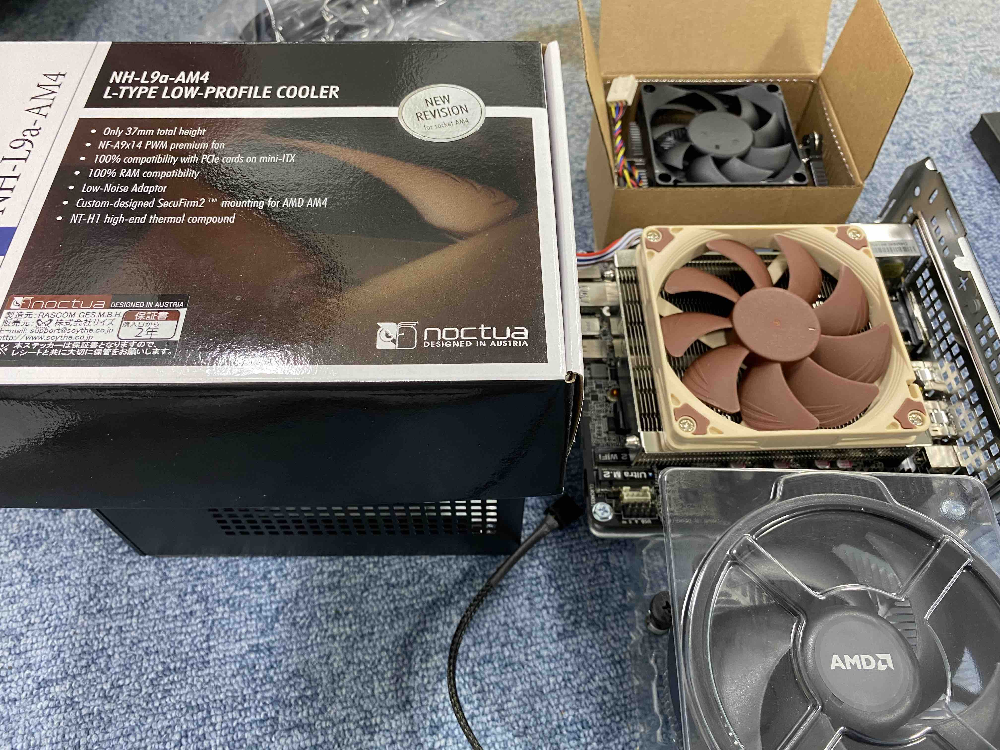

写真の上からマザーボード付属のCPUファン、真ん中が独自で購入したもの、一番下がRYZENのCPU付属のファンとなっています。
ファンの回転する音量や冷却効率を考慮した結果、真ん中の独自で用意したファンを使うことにしました。

次にCPUとCPUファンを接続していくのですが、これらは密着させる必要があり、少しでも間の熱伝導率を上げるためにグリスを塗っていきます。

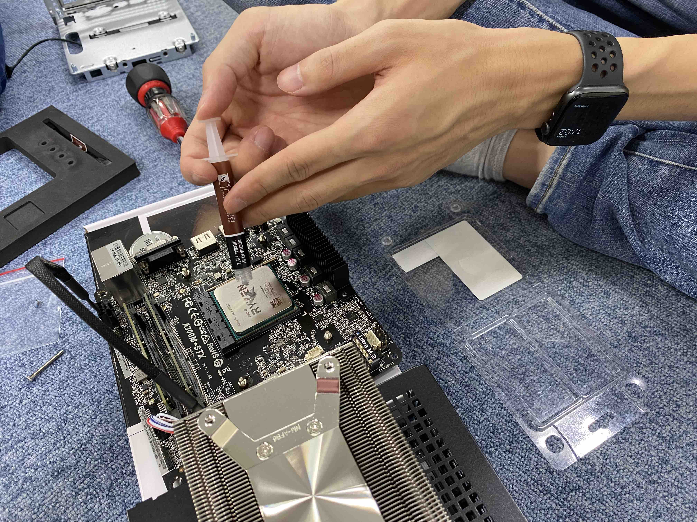

CPUとCPUファンの間に綺麗にグリスを塗り込みお互いを密着させたらネジで固定します。その完成形がこちらです。

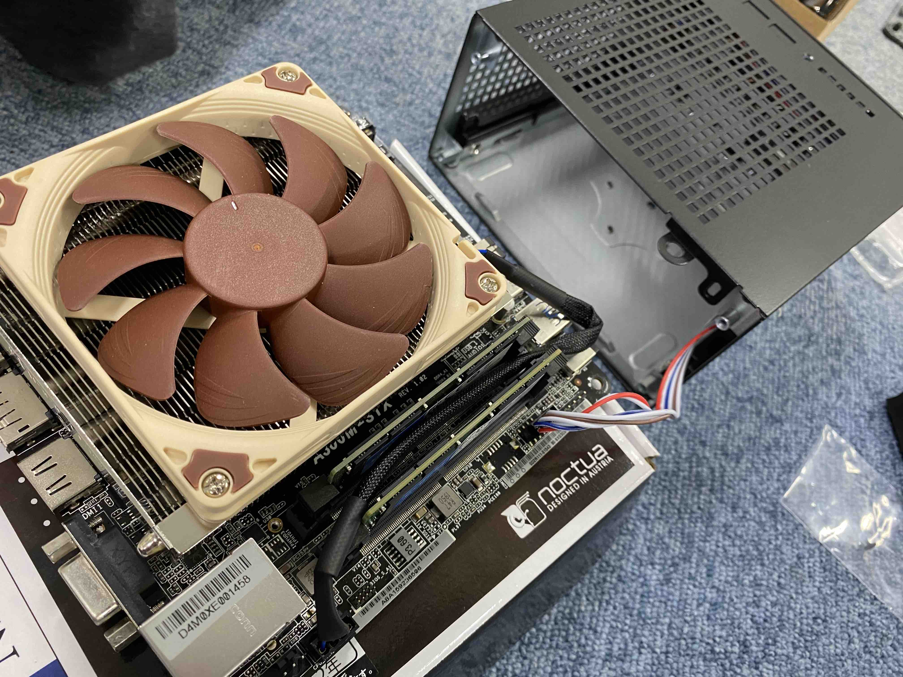

## まとめ

これにより一通りの工程が終了しました。組み立てたPCが実際に起動するか確認してみます。

繋げてみるとOSインストール画面が見えます。

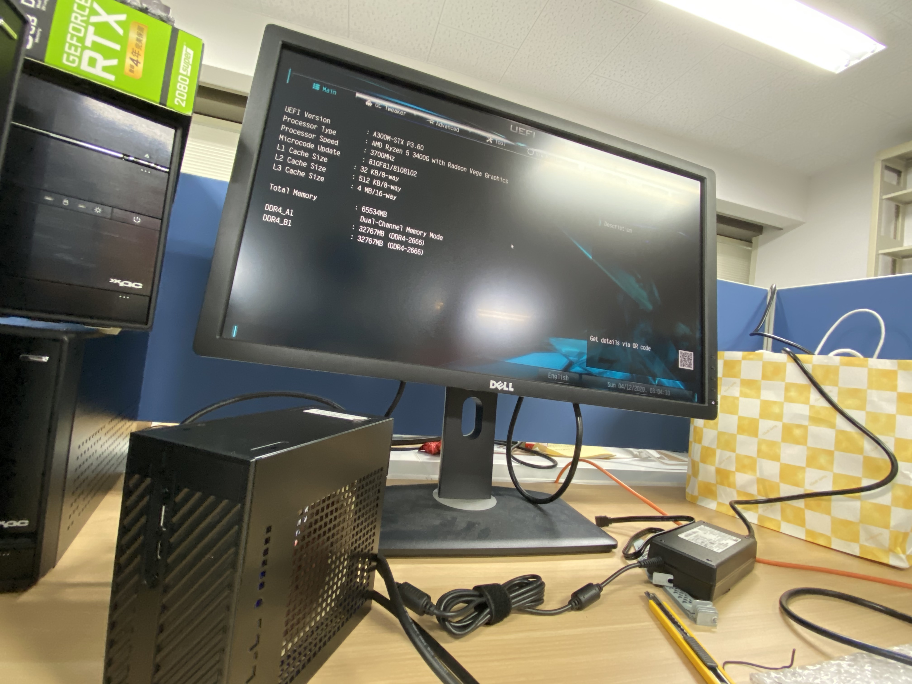

組み立てたPCをディスプレイに繋ぎ、あらかじめ用意したUSBのCentOSを差し込んで、手順通り進めて。。。

無事にCentOSのインストールまで完了しました！！
（何もぶっ壊さずここまで出来て良かった...）

## 感想
　情報学研究科の学生なのに、パソコンの中身理解せずにパソコンカタカタするのは、何か違うかなとは感じていたので今回の自作PCの経験はとても貴重でした。実際に触れて自分で組み立ててみないとわからないこともたくさんあると思います。取り組む前は難しいんだろうなというイメージを持っていたのですが、実際に初めてみると絵付きの説明書がわかりやすく、そこまで知識のない人でもできるかなと思いました。
　
　また、個人的にはここで別のCPUを使ったらどうなるんだろうとか、別のCPUファンを使うとどこにどういった影響が出るんだろうという興味があるので、またPCをいじれるような機会があれば積極的に参加したいなと思います。

PC組み立てにあたり協力してくださった研究室の先生・先輩方ありがとうございました！！
