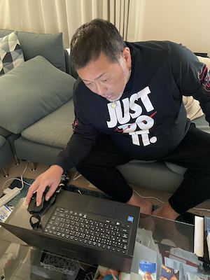
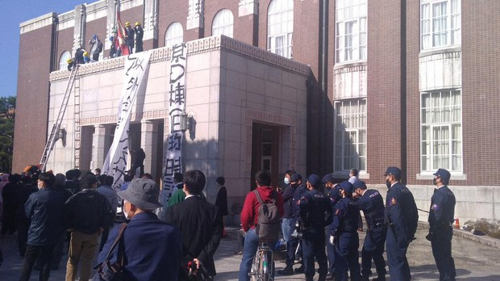
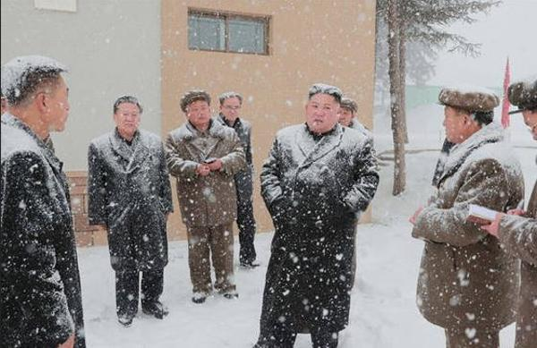
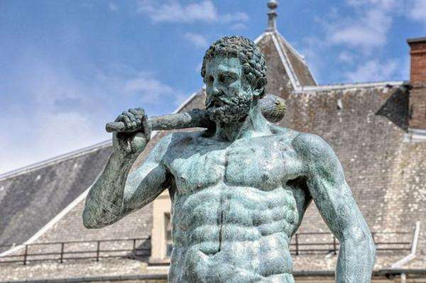

この記事は[Kyoto University Advent Calendar 2020](https://adventar.org/calendars/5040)の記事の12/23日目の記事です。あと1週間で今年も終わってしまうのが実感ありません。

[どらさんの京都の四季の記事](https://note.com/dora1998/n/n73de3bda6a92)では紹介されている写真がとにかく高画質で、季節によって変化する京都を楽しめました。

[Emileさんの強化学習記事](https://hexagon-emile.hatenablog.com/entry/2020/12/21/000000?_ga=2.97336284.2114428926.1608446236-1233767664.1584445520)はActor-Criticの理論から結果の動画まで紹介されていて面白かったです。強化学習は実装したことがないので僕も今度何か作ってみたいです。

こんにちは kent ([Twitter](https://twitter.com/kent0304))と言います。京大の情報学研究科のM1で自然言語処理と画像を絡めたマルチメディア言語処理と呼ばれる分野の研究に取り組んでいます。
京大のアドベントカレンダーも残すところ3日となりました。

みなさん今年のクリスマスはどう過ごすのでしょうか（煽り）

今年も**一人で**クリスマスを過ごすみなさんが、一人でも笑って過ごせるように、画像でボケるAIを今回は作っていきます。

ステップは2つだけなので簡単です。

**(1) 大喜利サービスボケてからデータを頂いてくる。** 
**(2) 画像キャプション生成モデルに用意したデータを突っ込んで学習させる。**

そしてはじめにコードのリンク貼っておきます。 
→[GitHub Code](https://github.com/kent0304/Image2Boke)

本記事ではコードの解説はしない（そこまで書く時間なかった）ので、気になる方は是非参考にしてください。

## データ用意
画像でボケるAIを作る上で、まずは特定の画像に対するボケのお手本のようなものをコンピュータにたくさん学習させる必要があります。従って、画像とそれに対するボケの日本語文のペアを準備する必要があります。

[**ボケて**](https://bokete.jp/boke/legend) は株式会社オモロキが運営している大喜利サイトで、ユーザーは「お題」として画像を投稿することができ、そのお題に対して他の複数のユーザーがテキストによる「ボケ」を投稿することで、ユーモアを笑い楽しむサービスです。

今回はこのサイトから約1.5万組（画像とボケテキスト）のデータを用意して学習させます。

## 画像キャプション生成
画像キャプション生成は、画像を入力として与えると画像の内容を説明する簡単なテキストを生成することを指します。

学習済みのCNNモデル（resnet18）から2048次元の特徴量を抽出し、これを時系列データを扱うことのできるRNNの一種であるLSTMに入力することで、テキストを生成するという仕組みになっています。損失関数にはソフトマックスエントロピーを用いて学習しており、DecoderとなるLSTMは1時刻前の隠れ状態を入力として、反復的に単語を出力してテキストを生成します。

専門外の方にもわかりやすく説明すると、画像を入力として、ボケを出力する関数になるように学習するわけなのです。

学習済みCNNモデルには今回resnet18を使いましたが、ユーモアを生み出す為に画像の詳細まで読み取る高精度なresnetよりも、層の浅いVGGを使った方がボケるAIには適しているという噂もあるようです。

画像キャプション生成技術は2014年のCVPRでGoogleが発表した ["Show and Tell: A Neural Image Caption Generator"](https://arxiv.org/abs/1411.4555)を皮切りに研究が進められており、自動運転や画面付きスマートスピーカーなど、適用先は多岐に渡っています。

今回はこちらのコード（[github](https://github.com/yunjey/pytorch-tutorial/tree/master/tutorials/03-advanced/image_captioning)）を参考にモデルを組みました。

## 学習 
学習には14495のデータを使い、バッチサイズは128で50エポック回した時のlossが下がり切った時のパラメータの値をボケてAI学習済みモデルとして保存しました。アドカレの期限に追われて必死でGPUをぶん回して50分ほどで学習は終了しました。

## 学習結果
学習に使わなかった画像を与えて、学習させたモデルにボケてもらいましょう。

# 自粛しなさい 
これは上手くぼけられてるのではないでしょうか。飛行機を摘んで止めているように見えるので納得です。

# 逃げろ…！俺が動きを止められるのは1分が限界だ… 
こちらは清原さんのtwitterの写真をお借りしたものです。ホワイトハッカーか何かでしょうか。

# このようなウーバーイーツがきたらヤバい奴と思ってくれて結構です 
こちらは友達のtwitterのアカウント画像。

# サザエさんエンディング体験・・・
うーん、よくわからないのでちょっと微妙かな。

# 空気を読めないよは…
こちらも日本語が少し崩れてしまっています。

# くす玉がなかなか割れない
いい感じ。

## まとめ
今回はwebサービスボケてのデータを使って、画像でボケるAIを実装しました。
実装自体はデータを用意してモデルに突っ込むだけなので1日もあればできるのですが、精度を上げていくにはこれをベースラインにして、いろいろな工夫が必要になります。

今回は簡単に定性的な評価を行いましたが、精度の高いシステムを開発する上で定量的評価が必要となります。しかし、対話システムや機械翻訳をはじめとしたテキスト生成の技術は評価が難しく、特にユーモアの評価は人によって価値観が異なるので、単純な数値で表現し切れない部分もあります。

自然言語処理のテキスト生成の技術は、コンピュータとの会話を可能にする夢のある技術ですが、ヒトのレベルに達するのはまだまだ先の話かもしれません。

（気が向いたら）webサービスかLINE botとして今後公開しようかなと思います。

それでは！