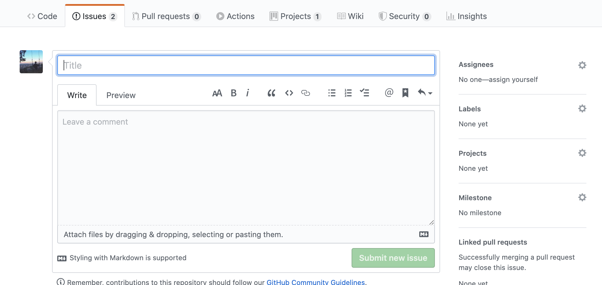
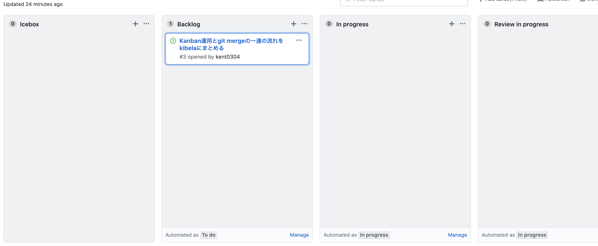

# 目標
共同開発する上で自分の編集したファイルをmergeするまでの流れをまとめます．
# 手順
1. githubでNew Issue作成
2. Projects内のBacklogに表示されたIssueをinProgressへスライド
3. ファイルを編集
4. ブランチを切る
5. git add する
6. git commit する
7. リモートの変更を取り込む
8.  git push する
9.  Pull リクエストを送る
10.  Pull リクエストのレビューを第三者に頼む
11.  レビューで許可されたらMerge完了
12.  最後にProjects内のIssueをDoneへスライド

では順番に取り組んでみましょう．

## githubでNew Issue作成
ProjectsないでIsuuesを作成します．取り組む内容(コーディング，資料作成，etc.)のテーマとその詳細を記入し，Submit new issue します．


## Backlogに表示されたIssueをinProgressへスライド
Projectsを開くと以下のように先ほど作成したIssueがBacklog内に表示されていることが確認できます．それぞれの項目は以下の通りです．

- Icebox : 取り組むべきこと(最優先ではない)
- Backlog : 取り組むべきこと(優先事項)
- In progress : 取り組んでいること
- Review in progress : Pull リクエストのレビューを受ける段階
- Reviewer Approved : レビュワーがリクエストを許可した段階
- Done : 作成したIssueが全て完了した段階

よって，先ほど作成したNew IssueはIn progressにスライドさせます．

※この運用方式を[Kanban方式](https://qiita.com/TAKAKING22/items/0a6412e5c3a95a90da50)と呼びます．(Kanbanは日本語の看板が起源で一応世界共通語)
この運用方式はソフトウェア業界ではもちろん，工場などハードウェアの世界でも使われています．




## ブランチを切る
実装する機能などに基づいたブランチを用意します．
```bash
// ブランチを作成して移動する
git checkout -b (ブランチ名)
```

## ファイルを編集
取り組むべき課題(作成したIssue)に取り組みます．

## git add する
git addコマンドを使って変更対象のファイルをローカルレポジトリに反映させます.

```bash
// git statusで確認できる
git add (ファイル名)
```
個人開発で`git add .`していた方，共同開発でこれをやると色々とぶっ壊してしまう可能性があるのでやめましょう．addするのは該当がいるだけね．

また，間違えてaddしたくないファイルをaddしてしまった場合は以下のコマンドでリセットできます．
```bash
// addを取り消す
git reset
```
ファイルを編集したもののaddしたくないものや，デバッグによる改行など意思に反して編集されたaddする必要のないファイルについては以下のコマンドでキャンセルしましょう．
```bash
git stash (ファイル名)
```

## git commit する
```bash
git commit -m "コメント(英語なら命令形，日本語なら体言止めが慣習的)"
```

## リモートの変更を取り込む
自分の変更をmasterに取り込む前に，他人の変更が入る場合があるためリモートの変更を取り込む必要があります．


```bash
# リモートの変更をローカルに取り込む
git fetch

# リモートのmasterの変更をrebaseでローカルのfeatureブランチに取り込む
# ※git rebase masterではローカルのmasterで更新されてしまうので必ずoriginを指定すること
git rebase origin/master
```

rebaseの実行時に，競合が発生する場合があります．

もし競合が発生した場合は，競合が発生したファイルを確認して競合の解消を行ってください．
```bash
# 競合が発生したファイルの編集結果をaddする。xxxはファイル名
git add xxx

# rebaseを実行する
git rebase --continue

# rebaseが完了するまでgit add / git rebase --continueを繰り返す
```

## git push する
ここまでで，自分の編集したファイルのcommit，リモートと自分のブランチとの差分の解消が行われました．いよいよリモートにpushします．
```bash
git push origin (自分のブランチ名)
```

## Pull リクエストを送る
githubの該当リポジトリを確認するとファイルの上に自分が送ったpushを確認できるのでそれをクリックします．

## Pull リクエストのレビューを第三者に頼む
レビューを第三者にお願いできるようになるので選択します．
(レビュワーはリクエストを確認して許可した後，先ほどのKanbann運用のIssueをReview in progressからReviewer approvedへスライドさせます．)

## レビューで許可されたらMerge完了
レビュワーに許可されたらmergeしていきましょう．Pull requestsから完了させます．このとき，コメント欄に`Close #issue1`と入力(途中まで入力すると該当項目が表示される)することで，作成したIssueは自動的にClosedされます．

## 最後にProjects内のIssueをDoneへスライド
最後にReviewr approvedにあるIssueをDoneに写して終了です．

# まとめ
ここまでが一連の流れです．取り組むべきタスクは積極的にNew Issueとして立ち上げ取り組んでみましょう！

また，gitを使ったPull Requestを投げる一連の流れは[この記事](https://qiita.com/takamii228/items/80c0996a0b5fa39337bd)を参考にしたので，参考にしてみてください．
